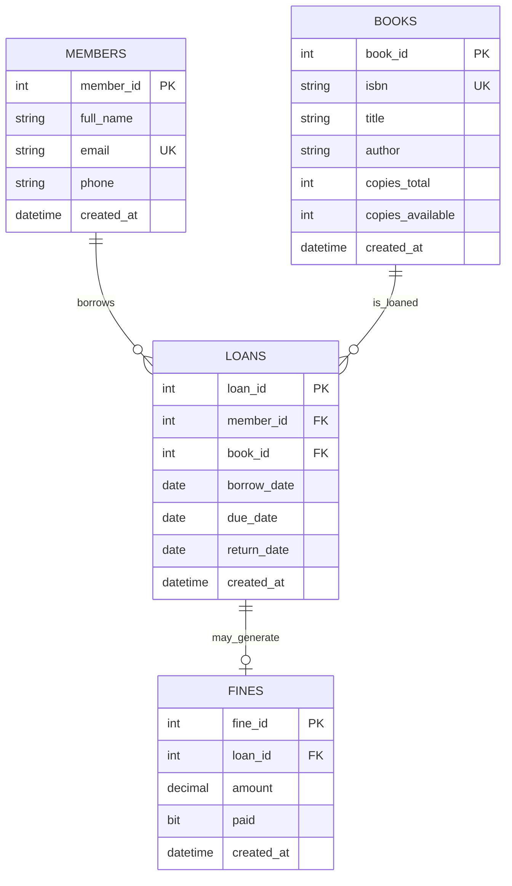

# ERD (Mermaid)

```mermaid
erDiagram
  MEMBERS ||--o{ LOANS : borrows
  BOOKS ||--o{ LOANS : is_loaned
  LOANS ||--o| FINES : may_generate

  MEMBERS {
    int member_id PK
    string full_name
    string email UK
    string phone
    datetime created_at
  }

  BOOKS {
    int book_id PK
    string isbn UK
    string title
    string author
    int copies_total
    int copies_available
    datetime created_at
  }

  LOANS {
    int loan_id PK
    int member_id FK
    int book_id FK
    date borrow_date
    date due_date
    date return_date
    datetime created_at
  }

  FINES {
    int fine_id PK
    int loan_id FK
    decimal amount
    bit paid
    datetime created_at
  }
```

